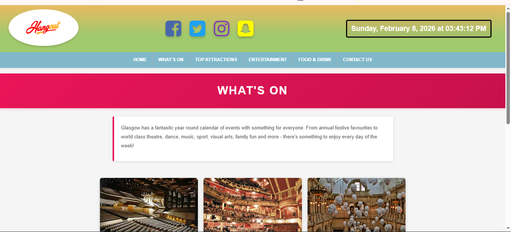
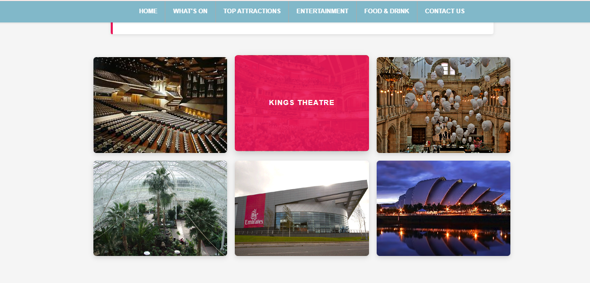
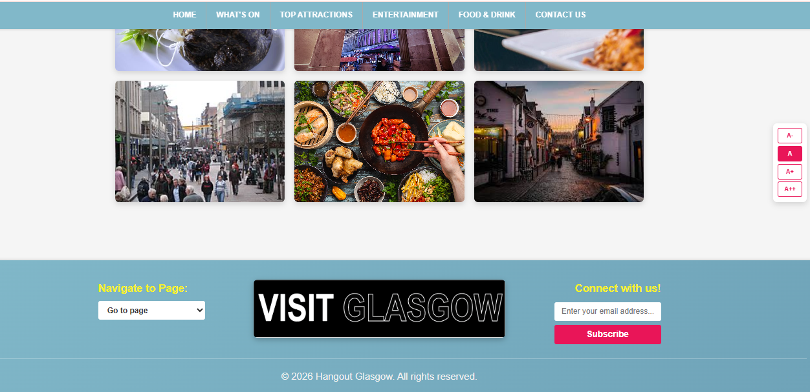
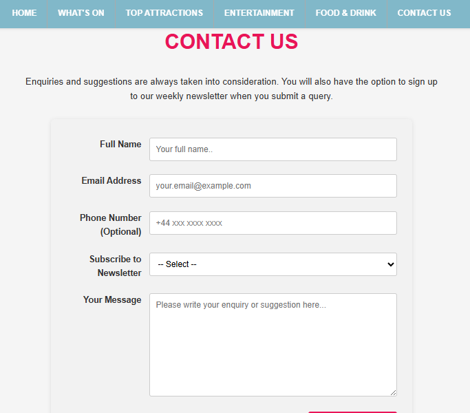

# AICT Project - 1st Semester: Glasgow Tour Website

Welcome to the **Glasgow Tour Website**! This is a dynamic, responsive, and interactive platform designed to help tourists and locals explore the vibrant city of Glasgow. Whether you're planning a visit or looking for local favorites, this website provides a seamless way to discover Glasgow's attractions, cultural events, dining options, and entertainment spots.

---

## 🌟 Project Overview

The Glasgow Tour Website is more than just an information portal—it's an **immersive experience** that combines aesthetics, usability, and functionality. The goal of this project is to create a user-friendly platform that allows visitors to:

- Quickly find key landmarks and attractions.
- Explore local restaurants, cafes, and nightlife.
- Stay updated on cultural events and entertainment options.
- Enjoy a smooth and responsive experience across all devices.

This project demonstrates practical skills in web development, UI/UX design, and responsive layout creation, making it an ideal first-semester AICT project.

---
## 📸 Project Screenshots

### Below are some Glimpse of the website made.

### What's On Page

### Food and Drink Page

### Contact us Page

---

## 🚀 Key Features

- **Responsive Design**  
  The website is fully responsive and works seamlessly across desktops, tablets, and mobile devices, ensuring an optimal user experience anywhere.

- **Interactive Navigation**  
  Easy-to-use navigation allows users to explore different sections without confusion. Pages and menus are structured intuitively for smooth browsing.

- **Attraction Showcase**  
  Highlights Glasgow’s iconic landmarks, popular food spots, and entertainment venues with visually appealing layouts.

- **Optimized Media**  
  Images are carefully optimized to ensure fast loading times without compromising quality, resulting in a smooth and efficient user experience.

---

## 🛠️ Technologies Used

**Frontend Development**  
- HTML5  
- CSS3  
- JavaScript  

**Design & Prototyping**  
- Figma (for wireframes and layout design)

**Development Tools**  
- Visual Studio Code (VS Code)  
- Image Optimization Tools (e.g., Photoshop, TinyPNG)  

---

## 📈 Future Enhancements

- **Interactive Maps:** Integrate Google Maps to provide location-based directions for attractions.  
- **Event Calendar:** Add a dynamic calendar for upcoming events and festivals.  
- **User Reviews & Ratings:** Allow users to leave reviews and rate attractions, enhancing interactivity.  
- **Multi-language Support:** Expand accessibility for international tourists.  

---

## 💡 Conclusion

The Glasgow Tour Website is a **comprehensive and user-friendly platform** for discovering the best of Glasgow. It combines modern web technologies, responsive design, and intuitive navigation to provide an engaging experience for both locals and tourists.  

Explore Glasgow like never before! 🌍✨

---

## ✍️ Author

**Muhammad Ahmad Shafique**
